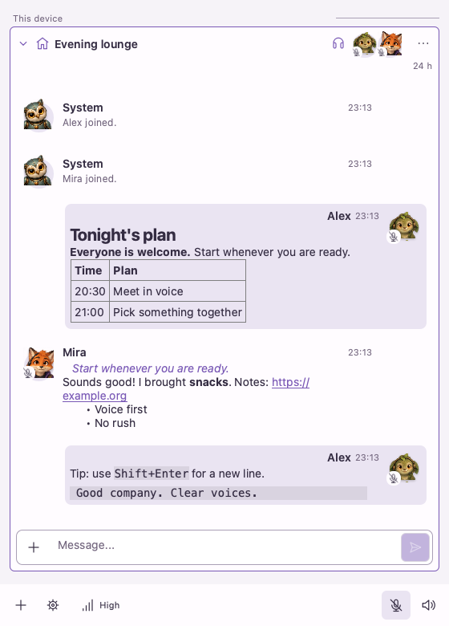
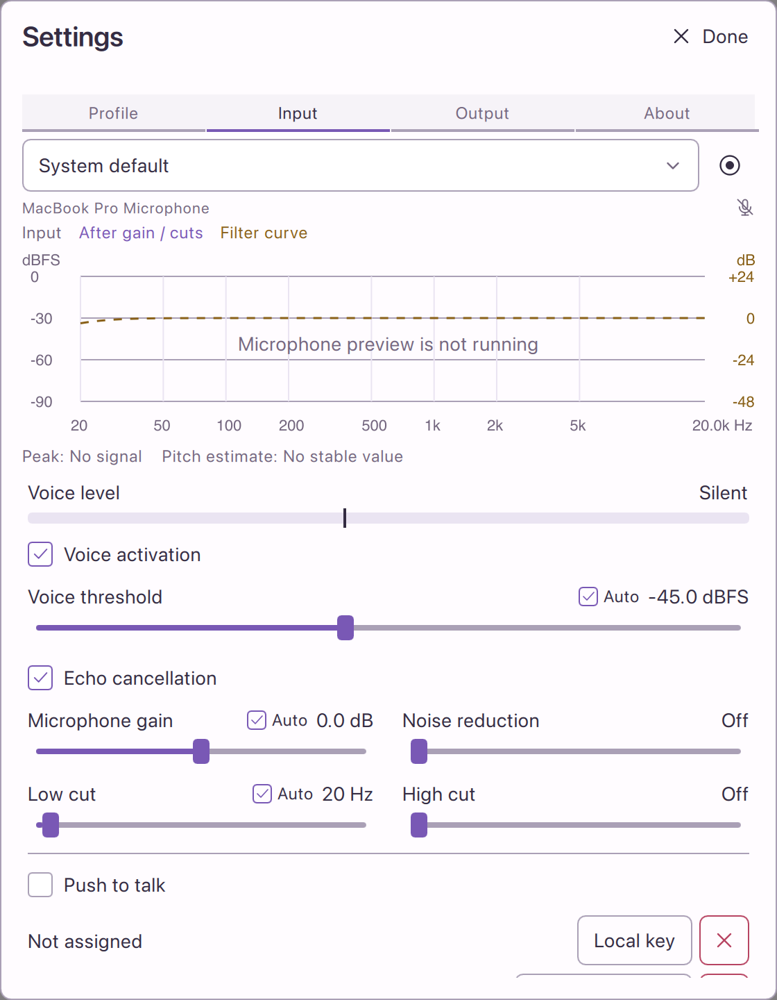

# SquadSpeak

Small voice chat. Your channels. Your computers.

SquadSpeak keeps voice, Markdown chat and animated portraits in one compact window.
Run it with friends on your local network, or connect directly to a host by name or IP address.
No chat account is required. Each running app can provide a channel while its owner talks somewhere else.



## Try it

Download the desktop packages from [Releases](https://github.com/YunaBraska/SquadSpeak/releases).
The release notes distinguish automated package checks from device tests that
still need real hardware. See [feature status and known limitations](docs/roadmap.md).

- **macOS:** Native Apple Silicon and Intel builds target macOS 13 or newer. Apple Silicon does not need Rosetta. Packages currently use an ad-hoc signature; Apple notarization is pending.
- **Linux:** The current package targets Ubuntu 26.04. Under Wayland, screen sharing currently captures the whole screen; individual windows follow later. Global push-to-talk depends on desktop support; voice activation and the app's own push-to-talk control remain available.
- **Windows:** Native x86_64 archive for Windows 10 version 1903 or newer, with runtime libraries included. Screen audio requires Windows 11 or Server 2022; Windows 10 retains screen video. CI currently runs on Server 2022; Windows 10 runtime verification and publisher signing are pending.
- **Android, iPhone and iPad:** Follow the desktop release; mobile packages are not ready yet.

On macOS with Homebrew:

```sh
brew install --cask yunabraska/tap/squadspeak
```

<details>
<summary>Install the Windows archive</summary>

1. Extract the ZIP into a folder you want to keep.
2. Run `bin/vc_redist.x64.exe` once to install Microsoft's C++ runtime. Windows may ask for administrator permission. If a newer runtime is already installed, keep it.
3. Run `bin/squadspeak.exe`. Keep the extracted folders together; you can create a shortcut to the executable.
4. Open the SquadSpeak icon in the system tray to show your channels.

For a short test with two copies on one PC, download the
[Windows device-test package](https://github.com/YunaBraska/SquadSpeak/releases/latest/download/squadspeak-windows-device-test.zip) instead. Extract it and open
`device-test/Start.cmd`. It includes the same app, two separate test profiles and
German instructions. No developer tools are needed.

</details>

<details>
<summary>Install the Ubuntu 26.04 archive</summary>

Install the runtime libraries once:

```sh
sudo apt update
sudo apt install --no-install-recommends \
  ca-certificates libssl3t64 libopus0 libsamplerate0 libpulse0 libsecret-1-0 \
  libavcodec62 libavformat62 libavutil60 libswscale9 libswresample6 \
  libqt6widgets6 libqt6quickcontrols2-6 libqt6sql6-sqlite \
  qml6-module-qtqml qml6-module-qtqml-models qml6-module-qtqml-workerscript \
  qml6-module-qtquick qml6-module-qtquick-controls qml6-module-qtquick-dialogs \
  qml6-module-qtquick-layouts qml6-module-qtquick-templates qml6-module-qtquick-window \
  qml6-module-qtmultimedia qt6-image-formats-plugins qt6-translations-l10n \
  qt6-qpa-plugins qt6-wayland fonts-noto-core fonts-noto-cjk libx11-6 libxi6 libxtst6
```

Extract the archive for your architecture and run `bin/squadspeak` from the
extracted folder. Keep its `bin`, `lib` and `share` folders together. A desktop
Secret Service, such as GNOME Keyring, stores the device identity. For servers
without one, use the protected identity-file option documented below.

</details>

## Join a conversation

1. Open SquadSpeak on both computers.
2. Press **+**, choose a discovered channel and select **Add**. If discovery does not find it, enter its DNS name or IP address, optionally followed by a port. The default port is `48763`. For Internet hosting, forward both TCP and UDP on that port; voice and screen sharing fall back to TCP when UDP is unavailable.
3. The desktop host approves your device. Enter the channel password if one is set.
4. Double-click the channel to join voice. Expand its row to read and send messages.

You can stay connected to several chats while speaking in one channel. The channel's **...** menu contains its settings and actions. Your own channel remains available while the app runs.

Approvals belong to the device's saved cryptographic identity. Changing Wi-Fi or IP address does not create a new device. Keep the app's identity when moving or backing up a profile; deleting it requires a new approval.

## Make yourself heard

Open **Settings > Input** to select a microphone, see its spectrum and adjust voice activation, echo cancellation, gain, noise reduction and frequency cuts. Each audio device keeps its own profile. Opening audio settings pauses transmission to the conversation; closing them restores your previous state.

New microphone profiles automatically reduce sustained bass rumble and keep signal peaks below the output limit. Gain and low cut each have an **Auto** switch; moving a slider makes that setting manual. Already distorted microphone recordings cannot always be repaired.



The screenshot shows the real settings interface with microphone capture stopped. Echo cancellation is on by default and can be switched off per microphone. Where supported and permitted, it uses the selected speaker device's digital mix, including other apps. The small reference label shows **Speaker audio** or **App audio only**. This reference stays on your computer and is never saved or shared.

Two copies on one computer can feed sound from one copy's speakers back into the other's microphone. The speaker reference is intended to cover both copies; without system-audio access, cancellation only knows each copy's own playback. Keep receiving speakers muted for capture tests, or use headphones for listening. Automatic handling of several open microphones and speakers in the same room is not yet verified.

Screen sharing starts with audio off. Its channel menu shows **App audio** or **Computer audio** before you enable sound. Computer audio may include other applications.

Received voices are levelled locally. **Settings > Output** controls the app volume; the channel menu controls music volume. Microphone and speaker badges on portraits show when either direction is unavailable or muted.

Choose your language in **Settings > Profile**. The interface offers 55 languages, including English, with one written standard per language. Language changes apply immediately.

Push-to-talk and remote push-to-talk accept key combinations. Remote control must first be allowed by the target device. It controls that device's conversation; it does not send the controller's microphone audio.

## Chat and hosting

- Markdown, tables, links and images live with their channel. History loads in pages as you scroll.
- The host keeps history across restarts and chooses whether new messages expire after 24 hours, 7 days or 30 days. Supporter adds 90, 180 and 360 days; readers do not need a pass.
- The host can approve, kick, block and unblock devices. A headless host accepts new devices after any password check; its block list still applies.
- The system bot announces joins and departures and can play radio. Each listener controls music volume independently.
- Hosting and personal participation are separate. A headless server has no microphone, speaker output or personal member.

For a quiet server:

```sh
squadspeak --headless --channel-name "Evening lounge" --port 48763
```

See [server configuration and commands](docs/development.md#headless-server) for passwords, block lists, configuration files and administration.

## Feedback and support

Found a bug or a translation that reads strangely? [Open an issue](https://github.com/YunaBraska/SquadSpeak/issues) with your app version, operating system and steps to reproduce it. Avoid including passwords or private device keys. For security vulnerabilities, use [private reporting](https://github.com/YunaBraska/SquadSpeak/security/advisories/new).

If you would like to support development, [buy Yuna a coffee](https://buymeacoffee.com/YunaBraska).
Voice, chat, radio, remote control and screen sharing are free. Yuna Supporter uses GitHub sign-in and adds more own channels, avatars and longer chat history. The one-time 12 USD tier is being prepared and is not available for purchase yet. It will cover one year across participating apps, with no device limit and up to seven days between online checks.

Building, testing, architecture and release details belong in [docs](docs/development.md).

## License

Copyright (c) 2026 YunaBraska. SquadSpeak's project code is available under
[GPL-3.0-only](LICENSE). Third-party components and media retain their own
licenses; see the [dependency notices](docs/third-party/README.txt) and
[audio fixture sources](tests/audio/README.md).
