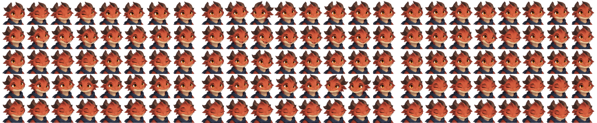
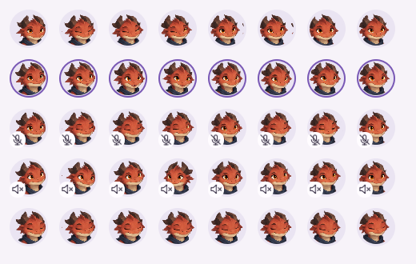

# Avatar production and playback

This contract implements SS-098, SS-119 and SS-129 and the variable-frame request U111. The catalog and selection rules remain part of [the product specification](voice-chat.md). Avatar artwork is bundled locally; it must not need a network request to remain visible in old messages.

User-supplied images and animation packs are deferred until after the first release by U121. Their import, distribution and retention rules require a later specification.

## Art direction

Create original, friendly fantasy and science-fiction bust portraits inspired by the readable silhouettes of older strategy games. Do not copy existing game characters, logos or costumes. Faces, eyes and silhouettes must remain distinct in a 42-48 px circular crop. Use clear shapes, restrained shading, transparent backgrounds and a consistent camera, scale, light direction and palette within each character. Avoid text, watermarks, tiny ornament and horror imagery.

The catalog consists of mossling, courier, mechanic, ember-dragon, moon-owl, mushroom-sage, coral-diver, clockwork-beetle, crystal-golem, cloud-shepherd, star-moth, lantern-ghost, desert-fennec, octopus-pilot, snail-captain, orchid-mantis, comet-axolotl, frost-yeti, raccoon-alchemist and sunflower-knight. The System bot is a separate friendly mechanical portrait with the same state contract. Stable IDs are asset identities, not translated display text.

## States and animation

| Row | State | Three distinct clip ideas |
| --- | --- | --- |
| 0 | Listening | Brief blink; small head tilt; quiet breath |
| 1 | Speaking | Mouth and cheek movement; small nod with speech; restrained shoulder/ear motion |
| 2 | Muted | Closed-mouth blink; knowing nod; relaxed breath |
| 3 | Deafened | Look aside; small ear/head gesture; settled rest |
| 4 | Sleeping | Slow breathing; brief sleepy shift; gentle head dip |

Every animated sheet has exactly five physical rows, one per state in the order above. Read frames left to right; variants of a state sit next to each other on that same row, never on additional rows. A row may contain one still frame, one animation or several independently drawn clips; three variants are the bundled catalog's art target, not a playback requirement. Each clip begins and ends near the same rest pose to avoid a jump at its boundary. Keep head position and occupied area consistent between frames. More frames refine the same motion; they do not add more head movements or shorten the rests. Eight frames per new clip is a production target, not a requirement to fabricate intermediate frames by crossfading two faces.

The app preview shows the first clip of each state, in the table's order. Read frames
left to right. The speaking border and microphone/speaker badges are UI overlays,
not part of the artwork. Other clips may have different frame counts or one still.

Idle, muted, deafened and sleeping members hold varied drawn poses between irregular movements. Each 4.5-6 second time slot chooses a start delay and destination from the member identity and slot number. Motion follows adjacent frames along the shorter route within the current state row, including across clip boundaries, then holds the destination. The next slot starts on that same pose. Short moves take less time; a move lasts at most 700 ms and can be absent when both poses match. Chat and member-list portraits of the same person remain synchronized, without storing a random generator or adding a timer per portrait. Speaking retains 560 ms loops, three per clip selection. The System bot uses the same quiet pose selection with at most 600 ms of motion per 12-18 second slot, including while playing music.

Offline uses the first sleeping frame, grayscale and no motion. Disabling animation preserves the speaking border. State priority and the shared identity/time source are implemented in `VoiceAvatar.qml`. The shared clock uses half the shortest frame duration, bounded to 16-125 ms, and stops when hidden or animation is disabled. The bundled dense portrait needs a 21 ms shared clock; more frames do not speed up motion.

All portraits use the same centered, aspect-preserving renderer. Circular clipping and grayscale never change the source crop or stretch it. Grayscale reads the complete physical-pixel buffer and restores its logical size, including Retina and fractional display scaling. Hidden portraits unload their canvas image. Speaking borders and status badges remain separate app overlays.

## Atlas contract

`ui/AvatarAtlas.js` is the single source for bundled atlas geometry and timing. `VoiceAvatar.qml` consumes it for both rectangular and circular rendering:

- `stride`: horizontal cell width in pixels.
- `inset`: crop margin on each edge, excluding padding or gutters.
- Five `rows`, each with `top`, `bottom`, `frames`, `duration`, `repeats` and `pause`.
- `frames` contains one or more positive clip frame counts; counts may differ within a row and between rows. `[1]` is a still state, `[12]` one twelve-frame animation and `[4, 8]` two variants. No placeholder frames or three-clip padding are required.
- `duration` is the duration of one whole speaking clip, or the maximum duration of an idle move, in milliseconds. With `pause = 0`, `repeats` repeats the clip before another variant is selected. A positive `pause` enables the quiet schedule described above and bounds its randomized start delay; resting poses are not restricted to the first frame.
- Atlas width is the largest row frame total multiplied by `stride`. Shorter rows leave transparent cells at the right. Rows tile the image height without gaps or overlap. Every crop stays within its state's physical row and inside the image. Row/cell dimensions and frame counts must be positive and finite.

The seventeen standard member sheets remain 1374 x 1145 RGBA PNG, five rows, three two-frame clips per row, 229 px cells. Mechanic, Courier and the animated System portrait use 4 px display insets to exclude neighboring artwork at cell edges; other sheets use zero inset. These are display crops only; the exported pixels remain unchanged. `system.png` remains a separate static portrait.

| Dense sheet | PNG size | Cell width | Row heights, top to bottom | Clip frame counts |
| --- | --- | --- | --- | --- |
| Mossling | 3616 x 540 | 113 | 108, 108, 108, 108, 108 | 8/8/8; deafened 8/8/16 |
| Courier | 2664 x 555 | 111 | 113, 112, 111, 113, 106 | 8/8/8 |
| Ember Dragon | 2616 x 541 | 109 | 109, 107, 109, 107, 109 | 8/8/8 |
| System | 2664 x 595 | 111 | 119, 119, 119, 119, 119 | 8/8/8; muted 8/4/4 |

This retains all 480 existing dense frames. Metadata never fabricates poses or infers emotions.

## Reproduction workflow

1. Select the stable character ID and design description above. Produce and approve one clean rest portrait at full size and at its actual circular display size.
2. Use that portrait as a visual reference for all states. Keep its camera, shape, clothes and lighting unchanged. Produce each clip as a sequence with the state-specific action, frame count and duration explicitly stated.
3. Lay out frames in exactly five physical rows in the order defined above. Put all variants side by side within their state, with a fixed cell width and constant cell height within each row. Export transparent sRGB RGBA PNG with no embedded metadata or external references. Keep the approved source artwork together with the export when it becomes available.
4. Update only that ID's atlas layout. Record the generation tool/model version, complete prompt, reference-image hashes, seed if supported, source/output hashes and any manual edits alongside the artwork's provenance. Unknown values must remain marked unknown.
5. Check every frame for nonempty visible content, consistent positioning, correct transparency, unwanted artifacts and smooth first/last-frame transition. Review every state in the running UI, not just the full-size sheet.
6. Run the avatar QML tests, including differing frame counts, duration, state transitions, catalog loading, chat/channel synchronization, reduced motion and grayscale offline display.

Prompt template:

> Original friendly [character description] bust portrait, transparent background, readable within a small circular crop. Preserve the supplied reference character's face, costume, camera and lighting. Draw [frame count] ordered frames of [one action] lasting [duration] ms, returning to the same rest pose. If producing a complete sheet, use exactly five physical rows, one per state, with all variants of that state side by side. Motion is subtle and includes [relevant mouth/head/shoulder detail]. No text, logos, status icons, speaking borders, added limbs, camera movement or background. Speaking highlights and microphone/speaker restrictions are drawn by the app, never in the artwork. Keep every frame centered at the same scale.

Generative illustration is not inherently byte-reproducible. The historical model version, prompts and seeds for the existing sheets were not recorded in the repository; do not invent them. The checked-in PNGs are the canonical artwork; the replaced Mossling original is retained in `docs/artwork`. The original set's combined SHA-256 was `6450c62a6e8b8f4fec49755df719e107df3582790617623972214223f3031175`, calculated over each filename plus a NUL byte plus its PNG bytes, in filename order. Packaging these originals is deterministic; recreating identical historical artwork from a new prompt is not guaranteed.

## Deterministic row rearrangement

The historical prompts below describe the original source sheets, not the current layout. Their 14-16 physical lines were rearranged on 2026-10-05 without redrawing or resampling. Source PNGs and their geometry remain available at commit `45d34f44173bfd6bc5a5c98247c47a03d3cc51cf` in `ui/avatars` and `ui/AvatarAtlas.js`; do not use a newly generated approximation as the source.

To reproduce the exported pixels with Pillow 12.3.0:

1. Decode those source PNGs as RGBA. For each state, enumerate every old `frameRect` in clip/frame order using the source metadata.
2. Expand each fractional crop to enclosing integer pixels: `(floor(x), floor(y), ceil(x + width), ceil(y + height))`. This preserves all pixels in the previously displayed crop; it rounds the sampling boundary outward by less than one pixel.
3. Choose the maximum crop width as the new cell width. For each state use its maximum crop height as that row's height. Allocate a transparent RGBA canvas of `max(frame totals) * cell width` by `sum(row heights)`.
4. Paste each crop at `(frame index * cell width, sum(previous row heights))` without an alpha mask or interpolation. Preserve source RGBA bytes, including transparent pixels; leave any bottom/right padding transparent.
5. Verify each pasted rectangle against its source crop byte for byte, then save PNG with `compress_level=9`, without metadata. Reopen and verify decoded pixels. Compression-library changes can affect PNG bytes without changing pixels.

| Shipped file | SHA-256 after rearrangement |
| --- | --- |
| `mossling.png` | `809d5296f411e40749a2782133d5def6116a3738e37bb62fd814475f565ec51d` |
| `courier.png` | `a93dcd8eccbbcba773460528e51c67a7197698880462478714c656e3df22f7d1` |
| `ember-dragon.png` | `c67b238a46c5b84a7542123551c1402cb79311bc41abf8054b3a2a3ea6a2de95` |
| `system-animated.png` | `c9f561293e1da62e01b64309c0600bbc566c5f516ab86dcdd0b579902c8ec432` |

## Mossling dense edition

The source character sheet is preserved as [mossling-reference.png](../artwork/mossling-reference.png), SHA-256 `e2486e1f87959e8ab326444b8c3f86480a1513fc5ec58f16dfbab46108de4032`. The original dense output was `ui/avatars/mossling.png`, SHA-256 `31116d6ab97e97ae8b60204247df93e43b1a2ff7b546ef998973d666f8e7ae71`. Its decoded area is 1,572,772 pixels, compared with the reference's 1,516,896 pixels. It contains no PNG metadata. No manual pixel edits were made. Engine version and seed were not exposed and are unknown.

The requested layout was eight columns and fifteen lines; the actual output contains sixteen lines at different dimensions. The rearrangement preserves the measured source crops, including the extra quiet deafened sequence. The original prompt is retained here rather than claiming the requested dimensions were produced:

> Use case: identity-preserve. Asset: production 2D avatar animation sprite atlas for SquadSpeak. Use the supplied mossling sheet ONLY as character/style reference: friendly little olive moss creature, amber eyes, leaf ears, bronze headset and small boom microphone, softly painted old strategy-game portrait. Preserve that exact recognizable character. Create ONE transparent RGBA PNG atlas, portrait canvas 1536 x 2880 pixels, exactly 8 columns by 15 rows, each cell exactly 192 x 192 pixels, no gutters, no labels, no grid, no text or symbols. Each row is a separate smooth 8-frame animation clip read left to right. Center every bust at the identical scale and anchor, leaving 8 pixels transparent padding inside every cell. Keep contours consistent, no camera motion. First and last frames of every row are near the same rest pose; the SIX middle frames must be newly drawn small sequential in-between poses, never a duplicate face or just two alternated poses. Subtle, readable movement, no energetic waving. Row 1: listening blink open/half/closed/half/open. Row 2: listening slight left head tilt and back. Row 3: listening gentle breath. Row 4: speaking lips/cheeks sequence, warm neutral expression. Row 5: speaking small nod plus mouth syllables. Row 6: speaking tiny ear motion plus mouth syllables. Row 7: muted closed mouth slow blink. Row 8: muted closed mouth tiny knowing nod. Row 9: muted closed mouth relaxed breath. Row 10: not listening, slow look right then back. Row 11: not listening tiny headset-side ear motion then rest. Row 12: not listening quiet settled pose and breath. Row 13: sleeping, closed eyes, subtle breathing. Row 14: sleeping, closed eyes, small comfortable shift and back. Row 15: sleeping, closed eyes, slight head dip and back. No facial identity drift, no extra limbs, no backgrounds or checkerboard, no different costumes. Quality target: face and eyes remain distinct at 48 pixels. This is a real precisely aligned sprite sheet for animation, not a poster of examples.

## System portrait dense edition

The reference is [system-reference.png](../artwork/system-reference.png), SHA-256
`05016a9a85695e10e7976573e75c7865906eae92b9451b95f333f06daef846f6`.
The selected built-in raster-generator output was 916 x 1717 RGBA, SHA-256
`2a7fc1826c73079e2587a38cf5944170ca63333fab8ac7ebbc65e8cb98ebd719`.
The tool did not expose its model version or seed. Its actual grid has fourteen
lines, so the rearranged sheet retains 112 distinct drawn frames and the variable clip lengths
above instead of assuming the requested 120 frames. The original compressed
pixel data was retained byte for byte; only the ancillary metadata chunk was
removed. The original metadata-free `ui/avatars/system-animated.png` SHA-256 was
`33a42d59e3b13ad97dcbc2c1278b609aef9c558764137ac6da14fae7d5e4a705`.
No resampling, interpolation or manual pixel edits were applied.

Complete prompt for the selected output:

> Use case: identity-preserve. Asset: production 2D animation sprite atlas for SquadSpeak's existing System portrait. The attached image is the exact character reference, not a layout to retain. Preserve the recognizable friendly clockwork owl: weathered teal metal, brass-gold trim and beak, large warm amber eyes, ivory face plates, small metal ears, chest medallion. Preserve its costume, camera, painted style and lighting. Create one genuinely transparent RGBA PNG sprite atlas, exactly 8 columns by 15 rows, evenly spaced identical square cells, no gutters, labels, numbers, grid or text. Prefer canvas 1536 x 2880 pixels and 192 pixel square cells. Each row is one smooth 8-frame clip read left to right, first and last near the same rest pose, with six distinct newly drawn intermediate poses. No two-frame alternation, crossfades, camera drift or dramatic movement. Keep the face prominent and centered for a 48 pixel circular crop, with 8 pixels transparent margin within each cell. Rows 1-3 listening: row 1 blink sequence open/half/closed/half/open; row 2 tiny head tilt left and return; row 3 small comfortable breath. Rows 4-6 speaking: row 4 small beak opening and closing; row 5 small beak syllables plus a subtle nod; row 6 gentle eye expression with small beak syllables. Rows 7-9 muted: closed-beak blink; quiet knowing nod; restrained breath. Rows 10-12 deafened: small glance right and back; tiny ear tilt and return; settled resting blink. Rows 13-15 sleeping: eyes closed and subtle breathing; tiny comfortable shift and return; slow head dip and return. No wings or hands covering the face, no added limbs or symbols. Clear consistent silhouette, polished warm original strategy-game portrait, not scary or energetic. This is a precisely aligned real sprite sheet for playback, not a poster of examples. Keep all 120 frames, three distinct quiet clips per state. Transparent backdrop, not a painted black background or checkerboard.

## Courier dense edition

The reference is the [previous Courier sheet](https://github.com/YunaBraska/SquadSpeak/blob/fc4651a7deea3f8d9111dda21709f3c3da9cea60/ui/avatars/courier.png),
SHA-256 `7fcc489501d3aa0f05a35f5274f17255aa7247ff99d892f78e819bf0788292ba`.
The built-in raster generator returned 916 x 1717 RGBA, SHA-256
`1a3621f53eaa4f27b04bb83b4b5e04f41cb6b7e666b727ee473592015f403888`.
Its model version and seed were not exposed. All 120 crops contain distinct,
visible pixels. The measured source state edges account for the actual output;
the requested dimensions were not produced. The original metadata-free PNG was 3,374,334 bytes,
SHA-256 `fff4b2b3184174e62577f712d6a9298799b040fe1612a431fe719816a34b1f59`.
Only the ancillary metadata chunk was removed; compressed pixels are unchanged.
There was no resampling, interpolation or manual pixel editing. Existing motion
duration, quiet pauses and shared clock stay unchanged.

Complete prompt:

> Use case: identity-preserve. Asset: production 2D animated avatar sprite atlas for SquadSpeak. The supplied image is ONLY the character and style reference: friendly orange fox courier with cream muzzle, dark headset and small boom microphone, purple jacket and brown shoulder strap, large warm brown eyes. Keep exactly this recognizable character, camera, clothes, scale and softly painted strategy-game portrait style. Create ONE transparent RGBA PNG sprite atlas, exactly 8 columns and 15 rows, equally sized cells, no gutters, no labels or grid. Prefer 1536 by 2880 pixels, 192-pixel square cells. Every row is one subtle ordered eight-frame clip read left to right. Keep all 120 frames. First and last frames return near the same resting pose; the six middle frames are genuinely drawn sequential in-between poses, not duplicated frames, crossfades or a two-pose alternation. Fixed bust anchor and head scale, face readable in a 48-pixel circular crop, eight pixels clear padding per cell. Rows 1-3 listening: one blink, tiny head tilt and return, quiet breath. Rows 4-6 speaking: restrained lip syllables, slight nod with lip motion, very small ear movement with lip motion. Rows 7-9 muted: closed-mouth blink, closed-mouth knowing nod, relaxed breath. Rows 10-12 deafened: slight side glance and return, tiny headset-side ear movement, settled blink. Rows 13-15 sleeping: closed eyes and breathing, tiny comfortable shift and return, gentle head dip and return. No hands covering the face, no dramatic movement, no added props or limbs, no text or icons, no red fringe, no checkerboard or painted backdrop. All frames are centered and evenly spaced for actual animation playback.

## Ember Dragon dense edition

The reference is the [previous Ember Dragon sheet](https://github.com/YunaBraska/SquadSpeak/blob/3b67ca2cf7d5408e4de7d1856d2b1a4320163f14/ui/avatars/ember-dragon.png),
SHA-256 `df364e28cf5cca6600ddaf72286cd251cf83d8f497262fb9e02c9df6ef66a272`.
The built-in raster generator returned 916 x 1717 RGBA with no embedded metadata;
its model version and seed were not exposed. The original source SHA-256 is:
`ec73e654c75046c0e20ebd1dc029a85a881a5b81a4cf4b99ada614bb4a9bbfca`.
All 120 measured crops are distinct and contain visible pixels. The actual
source state edges replace the requested dimensions. The original dense file grew by 323,099
bytes; decoded image area decreased by 458 pixels. No pixel edits, resampling,
interpolation or new playback timing were applied. All three clips in each of
five states and the stationary grayscale portrait were inspected at 48 px in
QML (`dragon/clip-{0,1,2}.png`, `dragon/offline.png` in the verification directory).

Complete prompt:

> Use case: identity-preserve. Production animation atlas for SquadSpeak. Reference image: existing friendly small orange ember dragon with amber eyes, dark curled horns, cream muzzle and navy scarf. Keep this exact original character, painted style, fixed bust scale and camera. Draw one transparent RGBA sprite sheet of 8 columns and 15 rows, all 120 cells present. Prefer 1536 x 2880, equally sized cells, clear margins, no text, symbols, borders or background. Each row is a separate quiet 8-frame animation: first and last frame near the same rest pose, six distinct intermediate drawings for smooth motion. Rows 1-3 listening: blink; tiny tilt and return; gentle breath. Rows 4-6 speaking: small mouth syllables; small mouth movement plus nod; gentle eyebrow movement with speech. Rows 7-9 muted: mouth closed blink; small knowing nod; quiet breath. Rows 10-12 not listening: brief glance aside and return; tiny head tilt; settled resting blink. Rows 13-15 sleeping: eyes stay closed, slow breath; slight sleepy shift and return; small head dip. Keep every portrait centered and readable in a 48px circle. No added hands, props or decorations, no dramatic poses, no camera shifts. Real alpha transparency and clean natural edges. More frames refine motion rather than adding movement.
